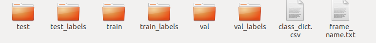
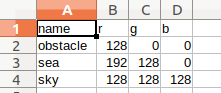
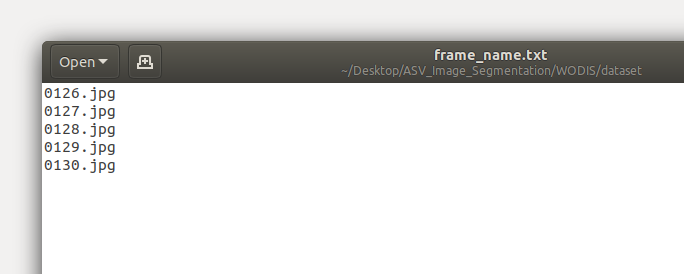
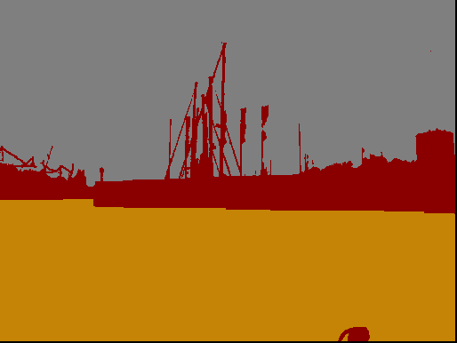

# WODIS: Water Obstacle Detection Network based on Image Segmentation for Autonomous Surface Vehicles in Maritime Environments
This is a repository for the paper named: **WODIS: Water Obstacle Detection Network based on Image Segmentation for Autonomous Surface Vehicles in Maritime Environments**.

# Summary

This is the code repository for the paper entitled **WODIS: Water Obstacle Detection Network based on Image Segmentation for Autonomous Surface Vehicles in Maritime Environments**, published to **IEEE Transactions on Instrumentation and Measurement (IEEE TIM)**, the paper [link](https://ieeexplore.ieee.org/document/9464268).

If you are interested in this work and use the materials, please cite the paper.

The abstract is as follows: "A reliable obstacle detection system is crucial for Autonomous Surface Vehicles (ASVs) to realise fully autonomous navigation with no need of human intervention. However, the current detection methods have particular drawbacks such as poor detection for small objects, low estimation accuracy caused by water surface reflection and a high rate of false-positive on water-sky interference. Therefore, we propose a new encoderdecoder structured deep semantic segmentation network, which is Water Obstacle Detection network based on Image Segmentation (WODIS), to solve above mentioned problems. The first design feature of WODIS utilises the use of an encoder network to extract high-level data based on different sampling rates. In order to improve obstacle detection at sea-sky-line areas, an Attention Refine Module (ARM) activated by both global average pooling and max pooling to capture high-level information has been designed and integrated into WODIS. In addition, a Feature Fusion Module (FFM) is introduced to help concatenate the multi-dimensional high-level features in the decoder network. The WODIS is tested and cross validated using four different types of maritime datasets with the results demonstrating that mIoU of WODIS can achieve superior segmentation effects for sea level obstacles to values as high as 91.3."

The dataset used in this project is available at:

- [Singapore Maritime Dataset (SMD)](https://sites.google.com/site/dilipprasad/home/singapore-maritime-dataset)
- [MaSTr1325](http://box.vicos.si/borja/mastr1325_dataset/)
- [MODD2](http://box.vicos.si/borja/modd2_dataset/)
- [Maritime Image Datset (MID)](https://github.com/aluckyi/MID)

In this paper, we only use the `MaSTr1325` dataset for training and the other three datasets are used for cross validation. Therefore, some of the image masks for the other three datasets are not so well-prepared. If you need the rest of the dataset for your own model training, please be careful about this mind. 

The training models for this paper can be downloaded here:

- [Xception weights](https://pan.baidu.com/s/1RTdHD5owLZr1vshrSPhlQA), passowrd: `1i98`
- [trained weights](https://pan.baidu.com/s/1a-EK6OMoU2IQjLO8r0n7EA) , password: `ec22`
- Option, you can use the link from Google Drive to download the weights:
- [weights](https://drive.google.com/drive/folders/1T2DaXTaQ_F-Ui48IYWAE86NJ6ct4rhWq?usp=sharing)


-------

# Quick Start

## 1. Requirement

These packages are mandatory installed to run the code successfully. 

```
pytorch-gpu or 'pytorch-cpu' for inference
opencv-python
pillow
thop
scipy
pandas
matplotlib
```


## 2. **Download the above weights to your computer**

Download the `Xception` and `trained weights` to your computer and place them into the project root repository. The links have been placed in the `Summary`. Tips: If you want to replace the `Xception` model to your desired models, please see the `WODIS.py` to change the `baseline` function to your desired models. In the root project, please use the `mkdir weights` command to build a folder to store the trained weights. 


## 3. Transfer the image annotations into RGB format

The orignal `MaSTr1325` dataset annotation for the images are coded with the `uint8` format and in this project, the `RGB` channels are used for the next training and inference. If you downloaded the dataset, please use the `transform_mask.py` to make the convert in the `./Dataset_preporcess`. 

  After converting the annotation of each image, please save it for the training. After getting the annotation, it is better to split the data into three different types for training, testing and validation. In my folder, I have these folders and files. 



The `test` and `test_labels` are used for testing and the raw images are saved at the `test` foler. The relevant labels are stored in `test_labels`. The train and validation are the same as testing files. The `class_dict.csv` stores the objects, sea and sky RGB values. 



The `frame_name.txt` is used for the inference. If the final validation or test has over one images, in order to get the name of the images, it saves into the file. It uses the `frame_name_to_txt.py` in the `./Dataset_preporcess` folder to save all the inference images. For example, the inference is here:



The original annotation is like this:


After converting into a RGB format:



## 4. Training the code:

Using the `train.py` trains the model based on the `MaSTr1325` dataset. The `cfg.py` has all the dataset route, `batch size` , `num class` and the `epoch num` setting, all the hyperparameters are saved in this file and duing the training, all the necessary information will be read from the file.  

```python
python train.py
```

use the command line to start the running session.  

After finishing the testing, the trained weights will be saved at the foler `weights`. 


## 5. Inference or test

For inference, please use the command line in your virtual environment. 

```python
python inference.py
```


# Cite information

```
@article{chen2021wodis,
  title={WODIS: Water Obstacle Detection Network based on Image Segmentation for Autonomous Surface Vehicles in Maritime Environments},
  author={Chen, Xiang and Liu, Yuanchang and Achuthan, Kamalasudhan},
  journal={IEEE Transactions on Instrumentation and Measurement},
  year={2021},
  publisher={IEEE}
}
```


# Contact information

If you meet some problems, please feel free to contact me at: <xiang.chen.17@ucl.ac.uk> . 

We are still working on improving the code reliability and scaliability. For any technical issues, please submit your issue. 


# Acknowledgement 

The authors acknowledge the use of the **UCL Myriad High Throughput Computing Facility (Myriad@UCL)**, and associated support services, in the completion of this work.

We also thanks the [MaSTr1325](http://box.vicos.si/borja/mastr1325_dataset/) for their plentiful training images privided for this paper. 


